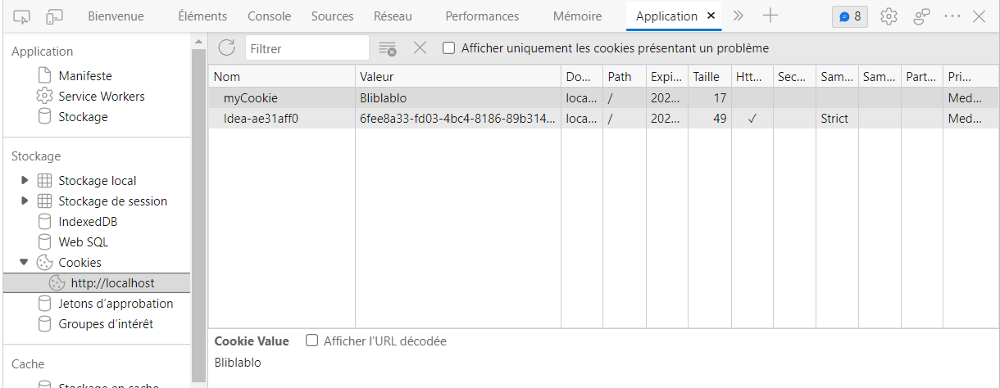
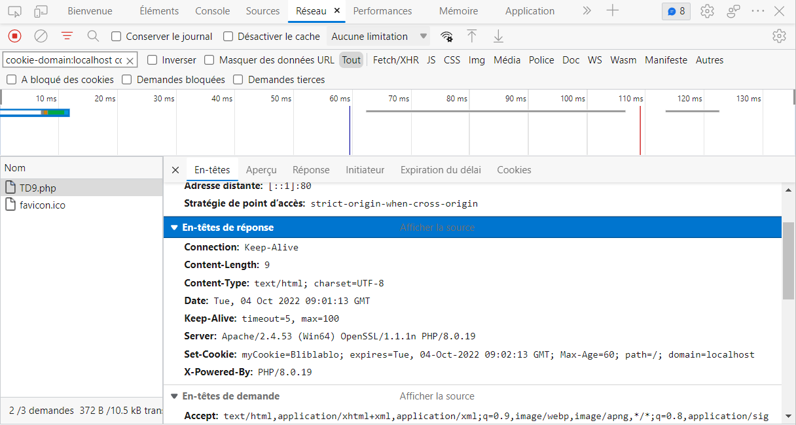
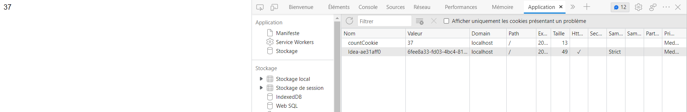

# Exercice 1

# Exercice 2

2)
   1. Le programme 2 ne voit pas le cookie créé avec le programme 1 car ils ne sont pas dans le même répertoire/sous-répertoire.

   2. 

# Exercice 3

# Exercice 4
